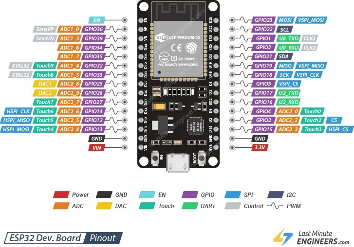
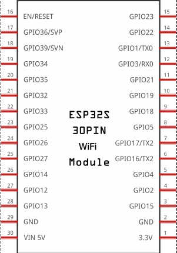

# ESP32

# Cadeira de Rodas Motorizada de Baixo Custo com ESP32

## Introdução

Ao longo da vida, muitas coisas podem acontecer com uma pessoa, e alguns desses acontecimentos podem mudar a vida de forma irreversível, como a perda da habilidade de andar. O ser humano, por ser um ser social, sente a necessidade de se locomover e realizar suas tarefas de forma independente ou em grupo. Quando a capacidade de andar é perdida, essa necessidade se torna mais difícil de ser suprida. Nesse contexto, a ciência e a tecnologia desempenham um papel fundamental, ajudando a facilitar a vida das pessoas em todas as fases da vida.

O objetivo principal deste trabalho é criar uma cadeira de rodas motorizada de baixo custo, proporcionando mais autonomia para pessoas paraplégicas ou com mobilidade reduzida. Além disso, a cadeira será integrada à rede de dados da casa, permitindo o monitoramento e a transmissão de informações sobre o estado da cadeira.

Para que essa cadeira possa ser controlada pelo usuário e enviar dados via rede, serão exploradas as vantagens que o microcontrolador **ESP32** oferece, tanto para o módulo de controle quanto para a comunicação com a rede.

## ESP32

O **ESP32** é um microcontrolador de baixo custo e altamente eficiente, desenvolvido pela **Espressif**. Ele é extremamente versátil, oferecendo suporte a comunicação sem fio, como **Bluetooth** e **Wi-Fi**, e uma variedade de protocolos de comunicação que atendem às necessidades deste projeto.

### Comunicação

#### Comunicação Serial

- **UART (Universal Asynchronous Receiver-Transmitter)**: A ESP32 possui várias portas UART, facilitando a comunicação serial com dispositivos como sensores, módulos GSM/GPS ou outros microcontroladores.
  
- **SPI (Serial Peripheral Interface)**: Um protocolo de comunicação rápida que permite a conexão com diversos periféricos, como sensores, displays e cartões SD. A ESP32 suporta até três interfaces SPI.

- **I2C (Inter-Integrated Circuit)**: Um protocolo serial que permite conectar múltiplos dispositivos em um único barramento, como sensores, displays e expansores de I/O. A ESP32 suporta várias interfaces I2C.

#### Comunicação Sem Fio

- **Wi-Fi (802.11 b/g/n)**: A ESP32 possui suporte embutido para Wi-Fi de 2.4 GHz. Ela pode atuar tanto como cliente (conectando-se a uma rede Wi-Fi existente) quanto como ponto de acesso (permitindo que outros dispositivos se conectem a ela).

- **Bluetooth Classic e Bluetooth Low Energy (BLE)**: A ESP32 suporta tanto **Bluetooth Classic** quanto **Bluetooth Low Energy (BLE)**, permitindo comunicação de baixa energia com dispositivos móveis e outros sensores.

#### Comunicação Digital/Analógica

- **PWM (Pulse Width Modulation)**: Embora o PWM não seja um protocolo de comunicação em si, ele é essencial para controlar motores e LEDs, ajustando o duty cycle para variar a intensidade ou a velocidade.

- **DAC (Digital-to-Analog Converter)**: A ESP32 possui dois conversores DAC integrados, capazes de converter um valor digital em uma saída analógica, útil para aplicações de áudio ou sinais analógicos.

- **ADC (Analog-to-Digital Converter)**: Com ADCs integrados, a ESP32 pode ler sinais analógicos de sensores como potenciômetros, sensores de temperatura, entre outros.

#### Comunicação IoT

- **MQTT (Message Queuing Telemetry Transport)**: Um protocolo leve de comunicação utilizado em aplicações IoT, muito usado para comunicação de máquina para máquina (M2M). A ESP32 pode se conectar a um broker MQTT para enviar e receber dados em tempo real.

- **HTTP/HTTPS**: A ESP32 pode realizar requisições HTTP ou HTTPS para se comunicar com servidores web, como APIs RESTful, permitindo enviar e receber dados pela internet.

- **WebSocket**: Permite comunicação bidirecional em tempo real entre a ESP32 e outros dispositivos (como navegadores), mantendo uma conexão aberta para transmitir dados rapidamente.

- **CoAP (Constrained Application Protocol)**: Um protocolo de aplicação leve, adequado para dispositivos IoT que precisam economizar energia e largura de banda de comunicação.

### Demais Características

A ESP32 possui portas configuráveis para operar com diferentes protocolos de comunicação. Por exemplo, a porta 03 (GPIO15) pode ser usada como entrada/saída digital, conversor analógico/digital, porta serial e também pode ser configurada para receber sensores capacitivos (touch). Lembre-se que a ESP32 opera com uma tensão de **3.3V**, por isso é importante verificar se os sensores utilizados são compatíveis com essa tensão.

---

Este projeto visa utilizar as capacidades do ESP32 para criar uma solução acessível, eficiente e inteligente para pessoas com mobilidade reduzida, promovendo mais autonomia e integração com a rede doméstica.

